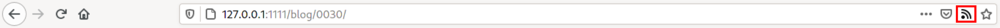

+++
title = "Découverte automatique du flux RSS sur le blog"
date = 2020-08-08T22:20:00Z
[taxonomies]
tags = ["blog", "zola"]
+++


Il est possible d'ajouter la découverte automatique d'un flux de donnée. Cela permet aux lecteurs de flux et aux navigateurs de signaler la présence d'un flux Atom ou RSS et de faciliter l'abonnement à celui-ci.

Par exemple dans mon cas, j'utilise l'extension [Livemarks](https://addons.mozilla.org/en-US/firefox/addon/livemarks/?src=search) pour [Firefox](https://fr.wikipedia.org/wiki/Mozilla_Firefox) et quand je vais sur les pages d'un blog contenant un flux de donnée, alors une petite icône m'indique la présence de celui-ci.


La mise en place de cette découverte automatique est très simple, il suffit d'ajouter le code html suivant entre les balises `<header>` de la page html.
```html
<link rel="alternate" type="application/rss+xml"
  title="Flux RSS"
  href="/rss.xml" />
  ```
dans le cas de RSS ou:
```html
<link rel="alternate" type="application/atom+xml"
  title="Flux Atom"
  href="/atom.xml" />
  ```
dans le cas de Atom.
<br/>
<br/>

[Zola](https://www.getzola.org/) a deux types de flux de donnée.
* Flux sur les billets.
* Flux sur les tags.

En modifiant la template de base, avec le code ci-dessus cela permet de référencer le flux vers les billets. On peut ensuite pointer sur le flux des tags en surchargeant la template de base grâce à la fonctionnalité d'héritage de [Tera](https://github.com/Keats/tera), sur les pages des tags. Ce [commit](https://github.com/uggla/blog/commit/a6603f8f75f2c836c4f0c580c86b960e77b0d7b7) montre comment cela est réalisé pour ce site.
